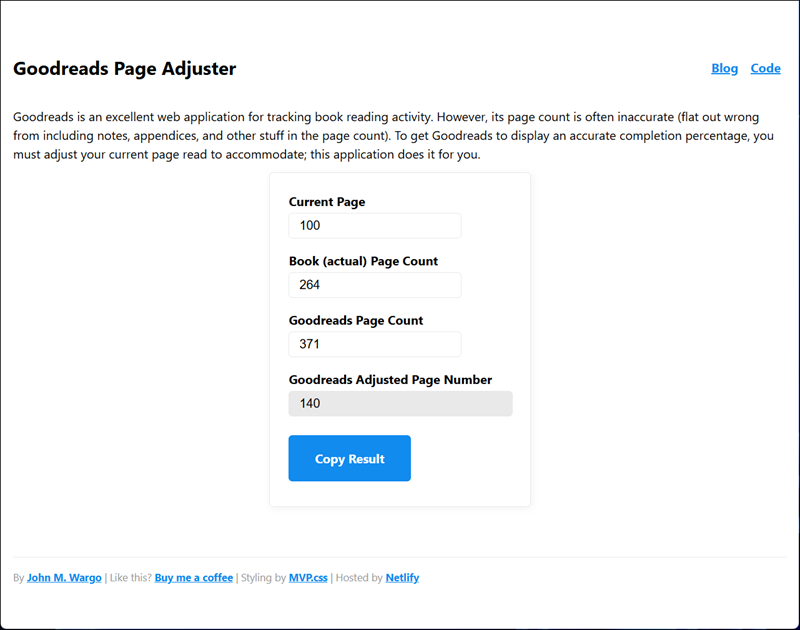

# Goodreads Page Adjuster

[Goodreads](https://www.goodreads.com/) is a great site for tracking the books you read, want to read, and have read. Its also useful for  following friends to see what they're reading. 

One of the things you can do in Goodreads when you're reading a book is track your progress in the app. You can indicate which page you're on and Goodreads shows you (and your friends) what percentage of the book you've completed. Unfortunately, a lot of books on Goodreads have an incorrect total page count recorded - wo when you update your current page in the app, the percentage will be incorrect.

The incorrect page count happens for several reasons:

1. You selected the wrong edition of the book when you added it to your reading list in Goodreads. This is easy to do when you add the book to your list because Goodreads doesn't show you that there are multiple editions. When you enter the book's ISBN, Goodreads grabs one of the entries for that ISBN and you'll have to go back in and pick a different edition later to get the right page count.
2. Sometimes a book's page count is zero (0) and I really don't know why that happens.

For many of the technical, business, or history books (and the like) that have appendices, Author notes, and references, the page count is automatically wrong because the page count Goodreads calculates your progress percentage from is the entirety of the book, not just the pages that contain content most readers would consider the actual body of the book. So, if you have a books that's 400 pages long but has 100 pages of reference material at the end, the progress calculation is automatically incorrect by 25% due to the way Goodreads calculates the length of the book.

With that in mind, I created this simple app to allow me to easily calculate an adjusted page number based on the actual length of the book's readable content. You enter the current page you're on plus the actual total page count (subtracting the stuff at the end you'll never read) and the Goodreads page count. The app then calculates an adjusted page count that scales your current page based on the total (goodreads) page count so the percentage progress calculation Goodreads does will be correct.

